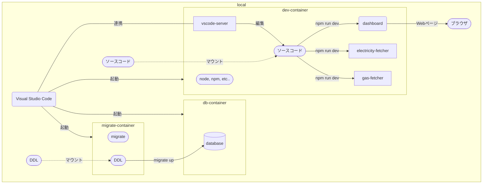

# my-home-dashboard

自宅向けのダッシュボードです。
生活に必要な各種情報を一覧で確認できます。

開発用ドキュメントを配置しています。

- [スキーマ定義](database/README.md)
- カバレッジ
  - [fetcher](coverage/fetcher/lcov-report/index.html)
  - [lib](coverage/lib/lcov-report/index.html)

