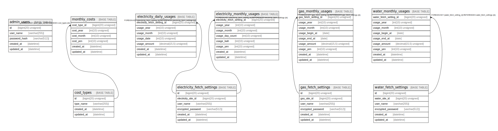

# my-home

## Tables

| Name | Columns | Comment | Type |
| ---- | ------- | ------- | ---- |
| [cost_types](cost_types.md) | 4 | 費用種別 | BASE TABLE |
| [electricity_daily_usages](electricity_daily_usages.md) | 6 | 日間電気使用状況 | BASE TABLE |
| [electricity_monthly_usages](electricity_monthly_usages.md) | 7 | 月間電気使用状況 | BASE TABLE |
| [gas_monthly_usages](gas_monthly_usages.md) | 8 | 月間ガス使用状況 | BASE TABLE |
| [monthly_costs](monthly_costs.md) | 6 | 月間費用 | BASE TABLE |
| [water_monthly_usages](water_monthly_usages.md) | 8 | 月間水道使用状況 | BASE TABLE |

## Relations

---

> Generated by [tbls](https://github.com/k1LoW/tbls)
