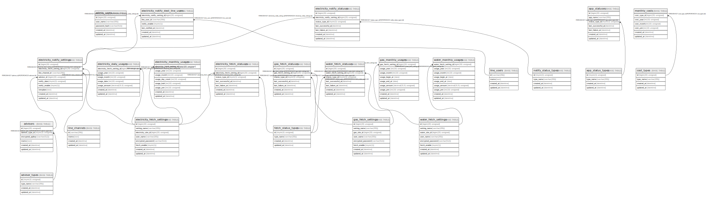

# my-home

## Tables

| Name | Columns | Comment | Type |
| ---- | ------- | ------- | ---- |
| [admin_users](admin_users.md) | 5 | 管理者ユーザー | BASE TABLE |
| [app_statuses](app_statuses.md) | 7 | アプリステータス | BASE TABLE |
| [app_status_types](app_status_types.md) | 4 | アプリステータス種別 | BASE TABLE |
| [cost_types](cost_types.md) | 4 | 費用種別 | BASE TABLE |
| [electricity_daily_usages](electricity_daily_usages.md) | 7 | 日間電気使用状況 | BASE TABLE |
| [electricity_fetch_settings](electricity_fetch_settings.md) | 8 | 電気料金の取得設定 | BASE TABLE |
| [electricity_fetch_statuses](electricity_fetch_statuses.md) | 7 | 電気料金取得ステータス | BASE TABLE |
| [electricity_monthly_usages](electricity_monthly_usages.md) | 8 | 月間電気使用状況 | BASE TABLE |
| [electricity_notify_dest_line_users](electricity_notify_dest_line_users.md) | 4 | 電気料金通知先のLINEユーザー | BASE TABLE |
| [electricity_notify_settings](electricity_notify_settings.md) | 8 | 電気料金の通知設定 | BASE TABLE |
| [electricity_notify_statuses](electricity_notify_statuses.md) | 7 | 電気料金通知ステータス | BASE TABLE |
| [fetch_status_types](fetch_status_types.md) | 4 | 取得ステータス種別 | BASE TABLE |
| [gas_fetch_settings](gas_fetch_settings.md) | 8 | ガス料金の取得設定 | BASE TABLE |
| [gas_fetch_statuses](gas_fetch_statuses.md) | 7 | ガス料金取得ステータス | BASE TABLE |
| [gas_monthly_usages](gas_monthly_usages.md) | 9 | 月間ガス使用状況 | BASE TABLE |
| [line_channels](line_channels.md) | 4 | LINEチャンネル | BASE TABLE |
| [line_users](line_users.md) | 4 | LINEユーザー | BASE TABLE |
| [monthly_costs](monthly_costs.md) | 6 | 月間費用 | BASE TABLE |
| [notify_status_types](notify_status_types.md) | 4 | 通知ステータス種別 | BASE TABLE |
| [water_fetch_settings](water_fetch_settings.md) | 8 | 水道料金の取得設定 | BASE TABLE |
| [water_fetch_statuses](water_fetch_statuses.md) | 7 | 水道料金取得ステータス | BASE TABLE |
| [water_monthly_usages](water_monthly_usages.md) | 9 | 月間水道使用状況 | BASE TABLE |

## Relations

---

> Generated by [tbls](https://github.com/k1LoW/tbls)
