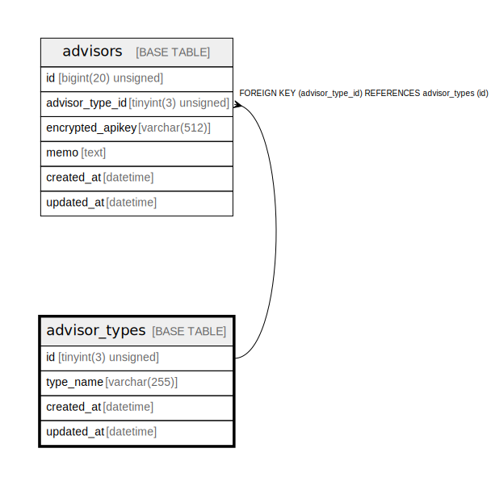

# advisor_types

## Description

アドバイザー種別

<details>
<summary><strong>Table Definition</strong></summary>

```sql
CREATE TABLE `advisor_types` (
  `id` tinyint(3) unsigned NOT NULL COMMENT 'アドバイザー種別ID',
  `type_name` varchar(255) NOT NULL COMMENT 'アドバイザー種別名',
  `created_at` datetime NOT NULL DEFAULT current_timestamp() COMMENT '作成日時(UTC)',
  `updated_at` datetime NOT NULL DEFAULT current_timestamp() ON UPDATE current_timestamp() COMMENT '更新日時(UTC)',
  PRIMARY KEY (`id`),
  UNIQUE KEY `uk_advisor_types_type_name` (`type_name`)
) ENGINE=InnoDB DEFAULT CHARSET=utf8mb4 COLLATE=utf8mb4_general_ci COMMENT='アドバイザー種別'
```

</details>

## Columns

| Name | Type | Default | Nullable | Extra Definition | Children | Parents | Comment |
| ---- | ---- | ------- | -------- | ---------------- | -------- | ------- | ------- |
| id | tinyint(3) unsigned |  | false |  | [advisors](advisors.md) |  | アドバイザー種別ID |
| type_name | varchar(255) |  | false |  |  |  | アドバイザー種別名 |
| created_at | datetime | current_timestamp() | false |  |  |  | 作成日時(UTC) |
| updated_at | datetime | current_timestamp() | false | on update current_timestamp() |  |  | 更新日時(UTC) |

## Constraints

| Name | Type | Definition |
| ---- | ---- | ---------- |
| PRIMARY | PRIMARY KEY | PRIMARY KEY (id) |
| uk_advisor_types_type_name | UNIQUE | UNIQUE KEY uk_advisor_types_type_name (type_name) |

## Indexes

| Name | Definition |
| ---- | ---------- |
| PRIMARY | PRIMARY KEY (id) USING BTREE |
| uk_advisor_types_type_name | UNIQUE KEY uk_advisor_types_type_name (type_name) USING BTREE |

## Relations



---

> Generated by [tbls](https://github.com/k1LoW/tbls)
