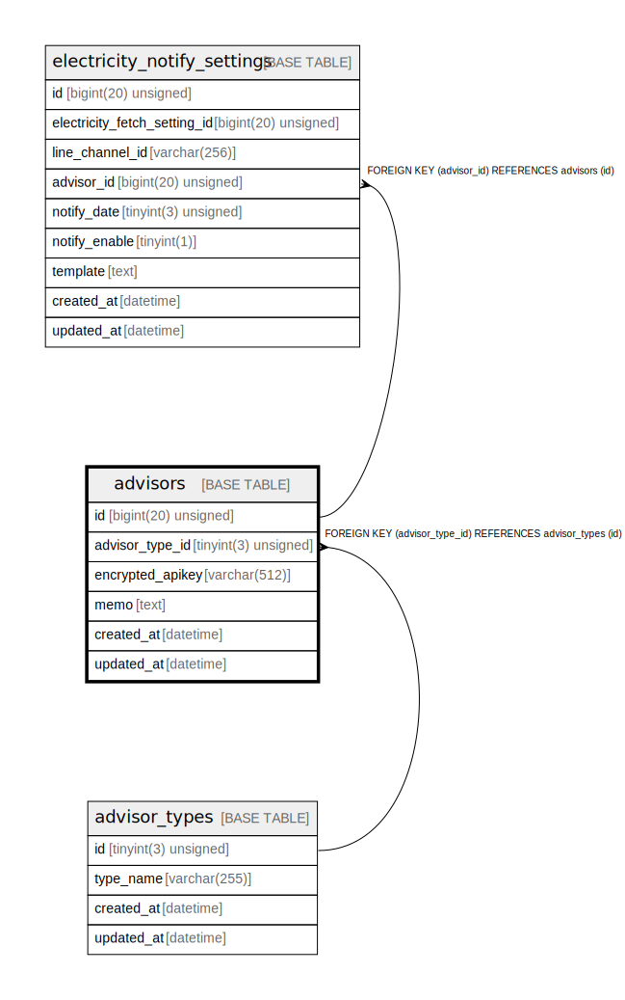

# advisors

## Description

アドバイザー

<details>
<summary><strong>Table Definition</strong></summary>

```sql
CREATE TABLE `advisors` (
  `id` bigint(20) unsigned NOT NULL AUTO_INCREMENT COMMENT 'アドバイザーID',
  `advisor_type_id` tinyint(3) unsigned NOT NULL COMMENT 'アドバイザー種別ID',
  `encrypted_apikey` varchar(512) NOT NULL COMMENT '暗号化済APIキー',
  `memo` text DEFAULT NULL COMMENT 'メモ',
  `created_at` datetime NOT NULL DEFAULT current_timestamp() COMMENT '作成日時(UTC)',
  `updated_at` datetime NOT NULL DEFAULT current_timestamp() ON UPDATE current_timestamp() COMMENT '更新日時(UTC)',
  PRIMARY KEY (`id`),
  UNIQUE KEY `id` (`id`),
  KEY `fk_advisors_advisor_type_id` (`advisor_type_id`),
  CONSTRAINT `fk_advisors_advisor_type_id` FOREIGN KEY (`advisor_type_id`) REFERENCES `advisor_types` (`id`)
) ENGINE=InnoDB DEFAULT CHARSET=utf8mb4 COLLATE=utf8mb4_general_ci COMMENT='アドバイザー'
```

</details>

## Columns

| Name | Type | Default | Nullable | Extra Definition | Children | Parents | Comment |
| ---- | ---- | ------- | -------- | ---------------- | -------- | ------- | ------- |
| id | bigint(20) unsigned |  | false | auto_increment | [electricity_notify_settings](electricity_notify_settings.md) |  | アドバイザーID |
| advisor_type_id | tinyint(3) unsigned |  | false |  |  | [advisor_types](advisor_types.md) | アドバイザー種別ID |
| encrypted_apikey | varchar(512) |  | false |  |  |  | 暗号化済APIキー |
| memo | text | NULL | true |  |  |  | メモ |
| created_at | datetime | current_timestamp() | false |  |  |  | 作成日時(UTC) |
| updated_at | datetime | current_timestamp() | false | on update current_timestamp() |  |  | 更新日時(UTC) |

## Constraints

| Name | Type | Definition |
| ---- | ---- | ---------- |
| fk_advisors_advisor_type_id | FOREIGN KEY | FOREIGN KEY (advisor_type_id) REFERENCES advisor_types (id) |
| id | UNIQUE | UNIQUE KEY id (id) |
| PRIMARY | PRIMARY KEY | PRIMARY KEY (id) |

## Indexes

| Name | Definition |
| ---- | ---------- |
| fk_advisors_advisor_type_id | KEY fk_advisors_advisor_type_id (advisor_type_id) USING BTREE |
| PRIMARY | PRIMARY KEY (id) USING BTREE |
| id | UNIQUE KEY id (id) USING BTREE |

## Relations



---

> Generated by [tbls](https://github.com/k1LoW/tbls)
