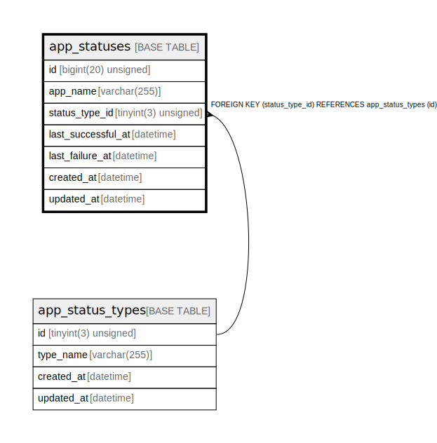

# app_statuses

## Description

アプリステータス

<details>
<summary><strong>Table Definition</strong></summary>

```sql
CREATE TABLE `app_statuses` (
  `id` bigint(20) unsigned NOT NULL AUTO_INCREMENT COMMENT 'アプリステータスID',
  `app_name` varchar(255) NOT NULL COMMENT 'アプリ名',
  `status_type_id` tinyint(3) unsigned NOT NULL DEFAULT 0 COMMENT 'ステータス種別ID',
  `last_successful_at` datetime DEFAULT NULL COMMENT '最終処理成功日時(UTC)',
  `last_failure_at` datetime DEFAULT NULL COMMENT '最終処理失敗日時(UTC)',
  `created_at` datetime NOT NULL DEFAULT current_timestamp() COMMENT '作成日時(UTC)',
  `updated_at` datetime NOT NULL DEFAULT current_timestamp() ON UPDATE current_timestamp() COMMENT '更新日時(UTC)',
  PRIMARY KEY (`id`),
  UNIQUE KEY `id` (`id`),
  UNIQUE KEY `uk_app_statuses_app_name` (`app_name`),
  KEY `fk_app_statuses_status_type_id` (`status_type_id`),
  CONSTRAINT `fk_app_statuses_status_type_id` FOREIGN KEY (`status_type_id`) REFERENCES `app_status_types` (`id`)
) ENGINE=InnoDB DEFAULT CHARSET=utf8mb4 COLLATE=utf8mb4_general_ci COMMENT='アプリステータス'
```

</details>

## Columns

| Name | Type | Default | Nullable | Extra Definition | Children | Parents | Comment |
| ---- | ---- | ------- | -------- | ---------------- | -------- | ------- | ------- |
| id | bigint(20) unsigned |  | false | auto_increment |  |  | アプリステータスID |
| app_name | varchar(255) |  | false |  |  |  | アプリ名 |
| status_type_id | tinyint(3) unsigned | 0 | false |  |  | [app_status_types](app_status_types.md) | ステータス種別ID |
| last_successful_at | datetime | NULL | true |  |  |  | 最終処理成功日時(UTC) |
| last_failure_at | datetime | NULL | true |  |  |  | 最終処理失敗日時(UTC) |
| created_at | datetime | current_timestamp() | false |  |  |  | 作成日時(UTC) |
| updated_at | datetime | current_timestamp() | false | on update current_timestamp() |  |  | 更新日時(UTC) |

## Constraints

| Name | Type | Definition |
| ---- | ---- | ---------- |
| fk_app_statuses_status_type_id | FOREIGN KEY | FOREIGN KEY (status_type_id) REFERENCES app_status_types (id) |
| id | UNIQUE | UNIQUE KEY id (id) |
| PRIMARY | PRIMARY KEY | PRIMARY KEY (id) |
| uk_app_statuses_app_name | UNIQUE | UNIQUE KEY uk_app_statuses_app_name (app_name) |

## Indexes

| Name | Definition |
| ---- | ---------- |
| fk_app_statuses_status_type_id | KEY fk_app_statuses_status_type_id (status_type_id) USING BTREE |
| PRIMARY | PRIMARY KEY (id) USING BTREE |
| id | UNIQUE KEY id (id) USING BTREE |
| uk_app_statuses_app_name | UNIQUE KEY uk_app_statuses_app_name (app_name) USING BTREE |

## Relations



---

> Generated by [tbls](https://github.com/k1LoW/tbls)
