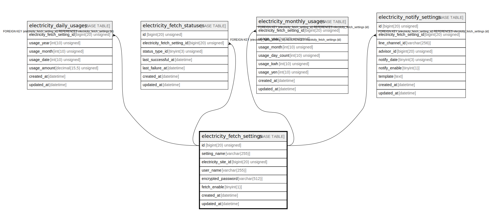

# electricity_fetch_settings

## Description

電気料金の取得設定

<details>
<summary><strong>Table Definition</strong></summary>

```sql
CREATE TABLE `electricity_fetch_settings` (
  `id` bigint(20) unsigned NOT NULL AUTO_INCREMENT COMMENT 'ID',
  `electricity_site_id` bigint(20) unsigned NOT NULL COMMENT '電気料金サイトID',
  `user_name` varchar(255) NOT NULL COMMENT 'ユーザー名',
  `encrypted_password` varchar(512) NOT NULL COMMENT '暗号化済パスワード',
  `created_at` datetime NOT NULL DEFAULT current_timestamp() COMMENT '作成日時(UTC)',
  `updated_at` datetime NOT NULL DEFAULT current_timestamp() ON UPDATE current_timestamp() COMMENT '更新日時(UTC)',
  PRIMARY KEY (`id`),
  UNIQUE KEY `id` (`id`),
  UNIQUE KEY `uk_electricity_fetch_settings_electricity_site_id_user_name` (`electricity_site_id`,`user_name`)
) ENGINE=InnoDB DEFAULT CHARSET=utf8mb4 COLLATE=utf8mb4_general_ci COMMENT='電気料金の取得設定'
```

</details>

## Columns

| Name | Type | Default | Nullable | Extra Definition | Children | Parents | Comment |
| ---- | ---- | ------- | -------- | ---------------- | -------- | ------- | ------- |
| id | bigint(20) unsigned |  | false | auto_increment |  |  | ID |
| electricity_site_id | bigint(20) unsigned |  | false |  |  |  | 電気料金サイトID |
| user_name | varchar(255) |  | false |  |  |  | ユーザー名 |
| encrypted_password | varchar(512) |  | false |  |  |  | 暗号化済パスワード |
| created_at | datetime | current_timestamp() | false |  |  |  | 作成日時(UTC) |
| updated_at | datetime | current_timestamp() | false | on update current_timestamp() |  |  | 更新日時(UTC) |

## Constraints

| Name | Type | Definition |
| ---- | ---- | ---------- |
| id | UNIQUE | UNIQUE KEY id (id) |
| PRIMARY | PRIMARY KEY | PRIMARY KEY (id) |
| uk_electricity_fetch_settings_electricity_site_id_user_name | UNIQUE | UNIQUE KEY uk_electricity_fetch_settings_electricity_site_id_user_name (electricity_site_id, user_name) |

## Indexes

| Name | Definition |
| ---- | ---------- |
| PRIMARY | PRIMARY KEY (id) USING BTREE |
| id | UNIQUE KEY id (id) USING BTREE |
| uk_electricity_fetch_settings_electricity_site_id_user_name | UNIQUE KEY uk_electricity_fetch_settings_electricity_site_id_user_name (electricity_site_id, user_name) USING BTREE |

## Relations



---

> Generated by [tbls](https://github.com/k1LoW/tbls)
