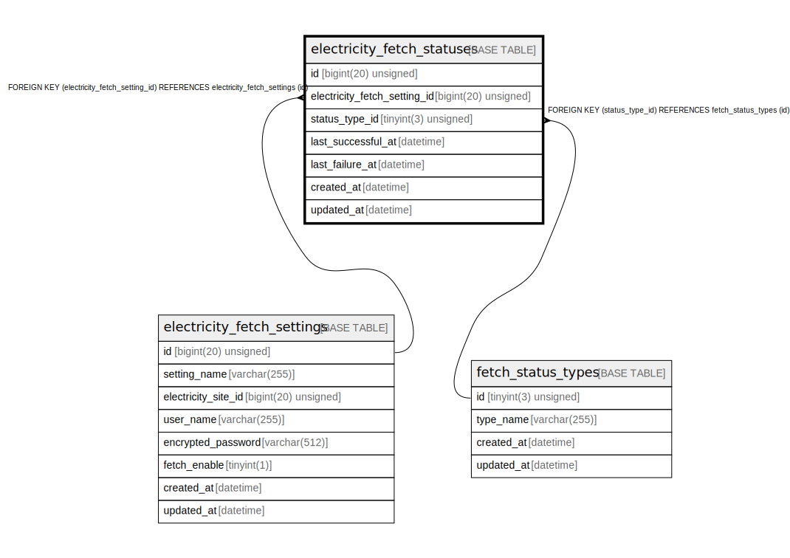

# electricity_fetch_statuses

## Description

電気料金取得ステータス

<details>
<summary><strong>Table Definition</strong></summary>

```sql
CREATE TABLE `electricity_fetch_statuses` (
  `id` bigint(20) unsigned NOT NULL AUTO_INCREMENT COMMENT '電気料金取得ステータスID',
  `electricity_fetch_setting_id` bigint(20) unsigned NOT NULL COMMENT '取得設定ID',
  `status_type_id` tinyint(3) unsigned NOT NULL COMMENT 'ステータス種別ID',
  `last_successful_at` datetime DEFAULT NULL COMMENT '最終成功日時(UTC)',
  `last_failure_at` datetime DEFAULT NULL COMMENT '最終失敗日時(UTC)',
  `created_at` datetime NOT NULL DEFAULT current_timestamp() COMMENT '作成日時(UTC)',
  `updated_at` datetime NOT NULL DEFAULT current_timestamp() ON UPDATE current_timestamp() COMMENT '更新日時(UTC)',
  PRIMARY KEY (`id`),
  UNIQUE KEY `id` (`id`),
  UNIQUE KEY `uk_electricity_fetch_statuses_electricity_fetch_setting_id` (`electricity_fetch_setting_id`),
  KEY `fk_electricity_fetch_statuses_status_type_id` (`status_type_id`),
  CONSTRAINT `fk_electricity_fetch_statuses_electricity_fetch_setting_id` FOREIGN KEY (`electricity_fetch_setting_id`) REFERENCES `electricity_fetch_settings` (`id`),
  CONSTRAINT `fk_electricity_fetch_statuses_status_type_id` FOREIGN KEY (`status_type_id`) REFERENCES `fetch_status_types` (`id`)
) ENGINE=InnoDB DEFAULT CHARSET=utf8mb4 COLLATE=utf8mb4_general_ci COMMENT='電気料金取得ステータス'
```

</details>

## Columns

| Name | Type | Default | Nullable | Extra Definition | Children | Parents | Comment |
| ---- | ---- | ------- | -------- | ---------------- | -------- | ------- | ------- |
| id | bigint(20) unsigned |  | false | auto_increment |  |  | 電気料金取得ステータスID |
| electricity_fetch_setting_id | bigint(20) unsigned |  | false |  |  | [electricity_fetch_settings](electricity_fetch_settings.md) | 取得設定ID |
| status_type_id | tinyint(3) unsigned |  | false |  |  | [fetch_status_types](fetch_status_types.md) | ステータス種別ID |
| last_successful_at | datetime | NULL | true |  |  |  | 最終成功日時(UTC) |
| last_failure_at | datetime | NULL | true |  |  |  | 最終失敗日時(UTC) |
| created_at | datetime | current_timestamp() | false |  |  |  | 作成日時(UTC) |
| updated_at | datetime | current_timestamp() | false | on update current_timestamp() |  |  | 更新日時(UTC) |

## Constraints

| Name | Type | Definition |
| ---- | ---- | ---------- |
| fk_electricity_fetch_statuses_electricity_fetch_setting_id | FOREIGN KEY | FOREIGN KEY (electricity_fetch_setting_id) REFERENCES electricity_fetch_settings (id) |
| fk_electricity_fetch_statuses_status_type_id | FOREIGN KEY | FOREIGN KEY (status_type_id) REFERENCES fetch_status_types (id) |
| id | UNIQUE | UNIQUE KEY id (id) |
| PRIMARY | PRIMARY KEY | PRIMARY KEY (id) |
| uk_electricity_fetch_statuses_electricity_fetch_setting_id | UNIQUE | UNIQUE KEY uk_electricity_fetch_statuses_electricity_fetch_setting_id (electricity_fetch_setting_id) |

## Indexes

| Name | Definition |
| ---- | ---------- |
| fk_electricity_fetch_statuses_status_type_id | KEY fk_electricity_fetch_statuses_status_type_id (status_type_id) USING BTREE |
| PRIMARY | PRIMARY KEY (id) USING BTREE |
| id | UNIQUE KEY id (id) USING BTREE |
| uk_electricity_fetch_statuses_electricity_fetch_setting_id | UNIQUE KEY uk_electricity_fetch_statuses_electricity_fetch_setting_id (electricity_fetch_setting_id) USING BTREE |

## Relations



---

> Generated by [tbls](https://github.com/k1LoW/tbls)
