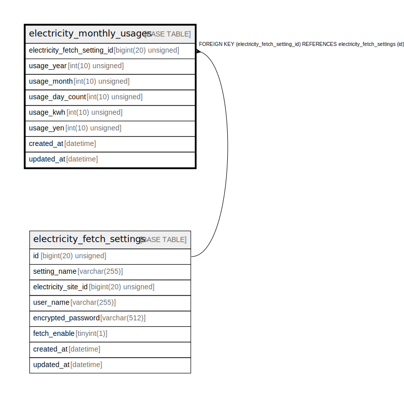

# electricity_monthly_usages

## Description

月間電気使用状況

<details>
<summary><strong>Table Definition</strong></summary>

```sql
CREATE TABLE `electricity_monthly_usages` (
  `electricity_fetch_setting_id` bigint(20) unsigned DEFAULT NULL COMMENT '電気料金取得設定ID',
  `usage_year` int(10) unsigned NOT NULL COMMENT '年',
  `usage_month` int(10) unsigned NOT NULL COMMENT '月',
  `usage_day_count` int(10) unsigned NOT NULL COMMENT '使用日数',
  `usage_kwh` int(10) unsigned NOT NULL COMMENT '使用量(kWh)',
  `usage_yen` int(10) unsigned NOT NULL COMMENT '料金(円)',
  `created_at` datetime NOT NULL DEFAULT current_timestamp() COMMENT '作成日時',
  `updated_at` datetime NOT NULL DEFAULT current_timestamp() ON UPDATE current_timestamp() COMMENT '更新日時',
  PRIMARY KEY (`usage_year`,`usage_month`)
) ENGINE=InnoDB DEFAULT CHARSET=utf8mb4 COLLATE=utf8mb4_general_ci COMMENT='月間電気使用状況'
```

</details>

## Columns

| Name | Type | Default | Nullable | Extra Definition | Children | Parents | Comment |
| ---- | ---- | ------- | -------- | ---------------- | -------- | ------- | ------- |
| electricity_fetch_setting_id | bigint(20) unsigned | NULL | true |  |  |  | 電気料金取得設定ID |
| usage_year | int(10) unsigned |  | false |  |  |  | 年 |
| usage_month | int(10) unsigned |  | false |  |  |  | 月 |
| usage_day_count | int(10) unsigned |  | false |  |  |  | 使用日数 |
| usage_kwh | int(10) unsigned |  | false |  |  |  | 使用量(kWh) |
| usage_yen | int(10) unsigned |  | false |  |  |  | 料金(円) |
| created_at | datetime | current_timestamp() | false |  |  |  | 作成日時 |
| updated_at | datetime | current_timestamp() | false | on update current_timestamp() |  |  | 更新日時 |

## Constraints

| Name | Type | Definition |
| ---- | ---- | ---------- |
| PRIMARY | PRIMARY KEY | PRIMARY KEY (usage_year, usage_month) |

## Indexes

| Name | Definition |
| ---- | ---------- |
| PRIMARY | PRIMARY KEY (usage_year, usage_month) USING BTREE |

## Relations



---

> Generated by [tbls](https://github.com/k1LoW/tbls)
