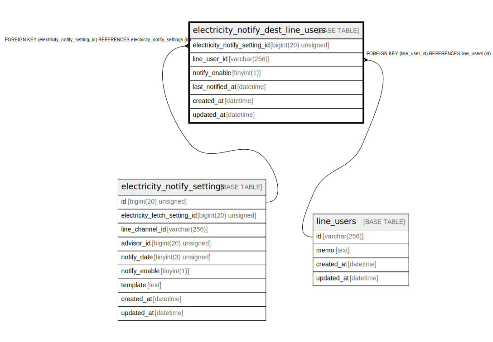

# electricity_notify_dest_line_users

## Description

電気料金通知先のLINEユーザー

<details>
<summary><strong>Table Definition</strong></summary>

```sql
CREATE TABLE `electricity_notify_dest_line_users` (
  `electricity_notify_setting_id` bigint(20) unsigned NOT NULL COMMENT '通知設定ID',
  `line_user_id` varchar(256) NOT NULL COMMENT 'LINEユーザーID',
  `notify_enable` tinyint(1) NOT NULL DEFAULT 1 COMMENT '通知処理の有効化',
  `last_notified_at` datetime DEFAULT NULL COMMENT '最終通知日時(UTC)',
  `created_at` datetime NOT NULL DEFAULT current_timestamp() COMMENT '作成日時(UTC)',
  `updated_at` datetime NOT NULL DEFAULT current_timestamp() ON UPDATE current_timestamp() COMMENT '更新日時(UTC)',
  PRIMARY KEY (`electricity_notify_setting_id`,`line_user_id`),
  KEY `fk_electricity_notify_dest_line_users_line_user_id` (`line_user_id`),
  CONSTRAINT `fk_electricity_notify_dest_line_users_line_user_id` FOREIGN KEY (`line_user_id`) REFERENCES `line_users` (`id`),
  CONSTRAINT `fk_electricity_notify_dest_line_users_notify_setting_id` FOREIGN KEY (`electricity_notify_setting_id`) REFERENCES `electricity_notify_settings` (`id`)
) ENGINE=InnoDB DEFAULT CHARSET=utf8mb4 COLLATE=utf8mb4_general_ci COMMENT='電気料金通知先のLINEユーザー'
```

</details>

## Columns

| Name | Type | Default | Nullable | Extra Definition | Children | Parents | Comment |
| ---- | ---- | ------- | -------- | ---------------- | -------- | ------- | ------- |
| electricity_notify_setting_id | bigint(20) unsigned |  | false |  |  | [electricity_notify_settings](electricity_notify_settings.md) | 通知設定ID |
| line_user_id | varchar(256) |  | false |  |  | [line_users](line_users.md) | LINEユーザーID |
| notify_enable | tinyint(1) | 1 | false |  |  |  | 通知処理の有効化 |
| last_notified_at | datetime | NULL | true |  |  |  | 最終通知日時(UTC) |
| created_at | datetime | current_timestamp() | false |  |  |  | 作成日時(UTC) |
| updated_at | datetime | current_timestamp() | false | on update current_timestamp() |  |  | 更新日時(UTC) |

## Constraints

| Name | Type | Definition |
| ---- | ---- | ---------- |
| fk_electricity_notify_dest_line_users_line_user_id | FOREIGN KEY | FOREIGN KEY (line_user_id) REFERENCES line_users (id) |
| fk_electricity_notify_dest_line_users_notify_setting_id | FOREIGN KEY | FOREIGN KEY (electricity_notify_setting_id) REFERENCES electricity_notify_settings (id) |
| PRIMARY | PRIMARY KEY | PRIMARY KEY (electricity_notify_setting_id, line_user_id) |

## Indexes

| Name | Definition |
| ---- | ---------- |
| fk_electricity_notify_dest_line_users_line_user_id | KEY fk_electricity_notify_dest_line_users_line_user_id (line_user_id) USING BTREE |
| PRIMARY | PRIMARY KEY (electricity_notify_setting_id, line_user_id) USING BTREE |

## Relations



---

> Generated by [tbls](https://github.com/k1LoW/tbls)
