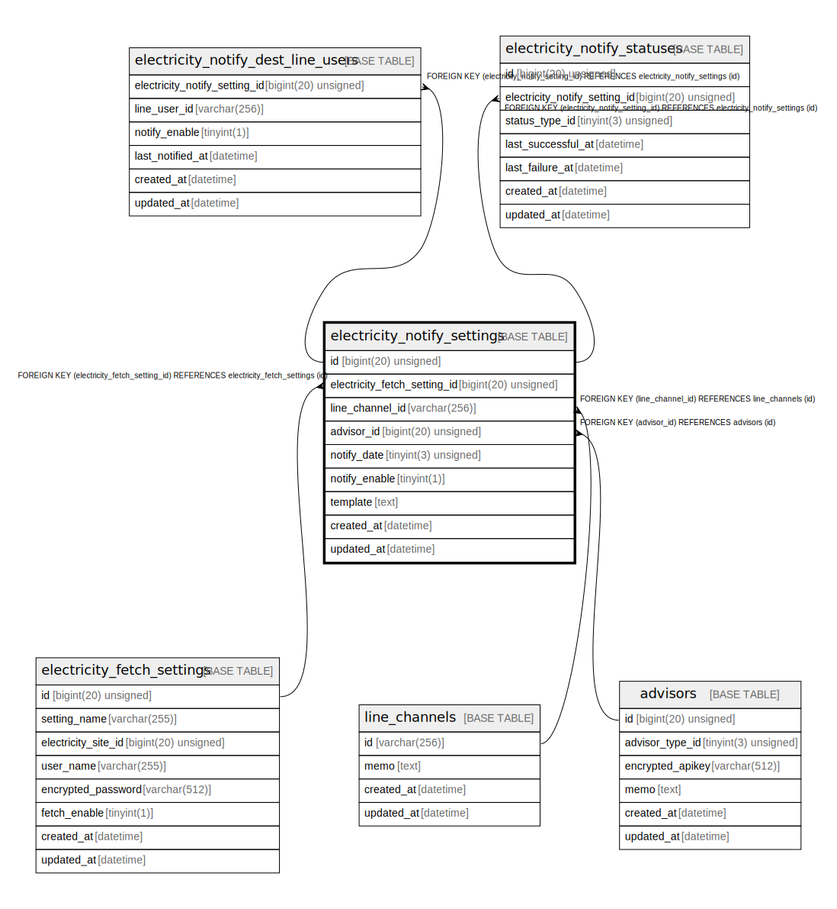

# electricity_notify_settings

## Description

電気料金の通知設定

<details>
<summary><strong>Table Definition</strong></summary>

```sql
CREATE TABLE `electricity_notify_settings` (
  `id` bigint(20) unsigned NOT NULL AUTO_INCREMENT COMMENT '通知設定ID',
  `electricity_fetch_setting_id` bigint(20) unsigned NOT NULL COMMENT '取得設定ID',
  `line_channel_id` varchar(256) NOT NULL COMMENT '通知用LINEチャンネルID',
  `notify_date` tinyint(3) unsigned NOT NULL COMMENT '通知日（1〜31）',
  `notify_enable` tinyint(1) NOT NULL DEFAULT 1 COMMENT '通知処理の有効化',
  `template` text NOT NULL DEFAULT '' COMMENT '通知メッセージのテンプレート',
  `created_at` datetime NOT NULL DEFAULT current_timestamp() COMMENT '作成日時(UTC)',
  `updated_at` datetime NOT NULL DEFAULT current_timestamp() ON UPDATE current_timestamp() COMMENT '更新日時(UTC)',
  PRIMARY KEY (`id`),
  UNIQUE KEY `id` (`id`),
  KEY `fk_electricity_notify_settings_electricity_fetch_setting_id` (`electricity_fetch_setting_id`),
  KEY `fk_electricity_notify_settings_line_channel_id` (`line_channel_id`),
  CONSTRAINT `fk_electricity_notify_settings_electricity_fetch_setting_id` FOREIGN KEY (`electricity_fetch_setting_id`) REFERENCES `electricity_fetch_settings` (`id`),
  CONSTRAINT `fk_electricity_notify_settings_line_channel_id` FOREIGN KEY (`line_channel_id`) REFERENCES `line_channels` (`id`)
) ENGINE=InnoDB DEFAULT CHARSET=utf8mb4 COLLATE=utf8mb4_general_ci COMMENT='電気料金の通知設定'
```

</details>

## Columns

| Name | Type | Default | Nullable | Extra Definition | Children | Parents | Comment |
| ---- | ---- | ------- | -------- | ---------------- | -------- | ------- | ------- |
| id | bigint(20) unsigned |  | false | auto_increment | [electricity_notify_dest_line_users](electricity_notify_dest_line_users.md) [electricity_notify_statuses](electricity_notify_statuses.md) |  | 通知設定ID |
| electricity_fetch_setting_id | bigint(20) unsigned |  | false |  |  | [electricity_fetch_settings](electricity_fetch_settings.md) | 取得設定ID |
| line_channel_id | varchar(256) |  | false |  |  | [line_channels](line_channels.md) | 通知用LINEチャンネルID |
| notify_date | tinyint(3) unsigned |  | false |  |  |  | 通知日（1〜31） |
| notify_enable | tinyint(1) | 1 | false |  |  |  | 通知処理の有効化 |
| template | text | '' | false |  |  |  | 通知メッセージのテンプレート |
| created_at | datetime | current_timestamp() | false |  |  |  | 作成日時(UTC) |
| updated_at | datetime | current_timestamp() | false | on update current_timestamp() |  |  | 更新日時(UTC) |

## Constraints

| Name | Type | Definition |
| ---- | ---- | ---------- |
| fk_electricity_notify_settings_electricity_fetch_setting_id | FOREIGN KEY | FOREIGN KEY (electricity_fetch_setting_id) REFERENCES electricity_fetch_settings (id) |
| fk_electricity_notify_settings_line_channel_id | FOREIGN KEY | FOREIGN KEY (line_channel_id) REFERENCES line_channels (id) |
| id | UNIQUE | UNIQUE KEY id (id) |
| PRIMARY | PRIMARY KEY | PRIMARY KEY (id) |

## Indexes

| Name | Definition |
| ---- | ---------- |
| fk_electricity_notify_settings_electricity_fetch_setting_id | KEY fk_electricity_notify_settings_electricity_fetch_setting_id (electricity_fetch_setting_id) USING BTREE |
| fk_electricity_notify_settings_line_channel_id | KEY fk_electricity_notify_settings_line_channel_id (line_channel_id) USING BTREE |
| PRIMARY | PRIMARY KEY (id) USING BTREE |
| id | UNIQUE KEY id (id) USING BTREE |

## Relations



---

> Generated by [tbls](https://github.com/k1LoW/tbls)
