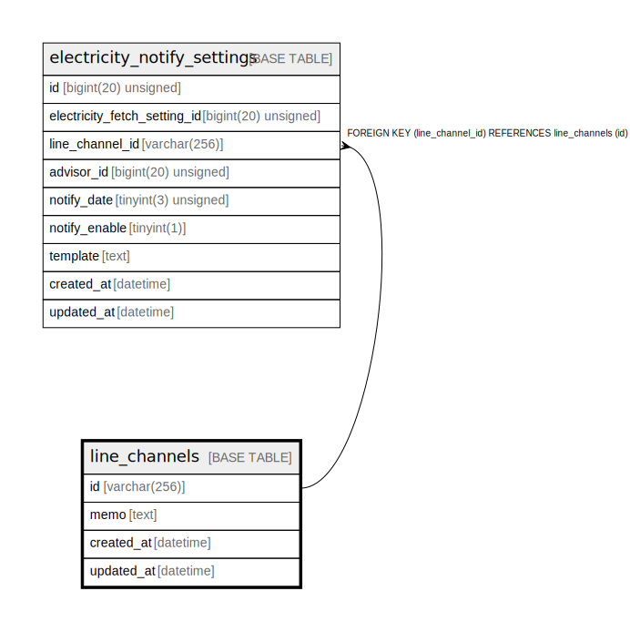

# line_channels

## Description

LINEチャンネル

<details>
<summary><strong>Table Definition</strong></summary>

```sql
CREATE TABLE `line_channels` (
  `id` varchar(256) NOT NULL COMMENT 'LINEチャンネルID',
  `memo` text DEFAULT NULL COMMENT 'メモ',
  `created_at` datetime NOT NULL DEFAULT current_timestamp() COMMENT '作成日時',
  `updated_at` datetime NOT NULL DEFAULT current_timestamp() ON UPDATE current_timestamp() COMMENT '更新日時',
  PRIMARY KEY (`id`)
) ENGINE=InnoDB DEFAULT CHARSET=utf8mb4 COLLATE=utf8mb4_general_ci COMMENT='LINEチャンネル'
```

</details>

## Columns

| Name | Type | Default | Nullable | Extra Definition | Children | Parents | Comment |
| ---- | ---- | ------- | -------- | ---------------- | -------- | ------- | ------- |
| id | varchar(256) |  | false |  | [electricity_notify_settings](electricity_notify_settings.md) |  | LINEチャンネルID |
| memo | text | NULL | true |  |  |  | メモ |
| created_at | datetime | current_timestamp() | false |  |  |  | 作成日時 |
| updated_at | datetime | current_timestamp() | false | on update current_timestamp() |  |  | 更新日時 |

## Constraints

| Name | Type | Definition |
| ---- | ---- | ---------- |
| PRIMARY | PRIMARY KEY | PRIMARY KEY (id) |

## Indexes

| Name | Definition |
| ---- | ---------- |
| PRIMARY | PRIMARY KEY (id) USING BTREE |

## Relations



---

> Generated by [tbls](https://github.com/k1LoW/tbls)
