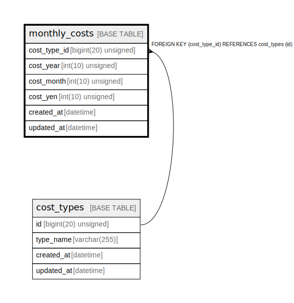

# monthly_costs

## Description

月間費用

<details>
<summary><strong>Table Definition</strong></summary>

```sql
CREATE TABLE `monthly_costs` (
  `cost_type_id` bigint(20) unsigned NOT NULL COMMENT '費用種別ID',
  `cost_year` int(10) unsigned NOT NULL COMMENT '年',
  `cost_month` int(10) unsigned NOT NULL COMMENT '月',
  `cost_yen` int(10) unsigned NOT NULL COMMENT '料金(円)',
  `created_at` datetime NOT NULL DEFAULT current_timestamp() COMMENT '作成日時(UTC)',
  `updated_at` datetime NOT NULL DEFAULT current_timestamp() ON UPDATE current_timestamp() COMMENT '更新日時(UTC)',
  PRIMARY KEY (`cost_type_id`,`cost_year`,`cost_month`),
  CONSTRAINT `fk_monthly_costs_cost_type_id` FOREIGN KEY (`cost_type_id`) REFERENCES `cost_types` (`id`)
) ENGINE=InnoDB DEFAULT CHARSET=utf8mb4 COLLATE=utf8mb4_general_ci COMMENT='月間費用'
```

</details>

## Columns

| Name | Type | Default | Nullable | Extra Definition | Children | Parents | Comment |
| ---- | ---- | ------- | -------- | ---------------- | -------- | ------- | ------- |
| cost_type_id | bigint(20) unsigned |  | false |  |  | [cost_types](cost_types.md) | 費用種別ID |
| cost_year | int(10) unsigned |  | false |  |  |  | 年 |
| cost_month | int(10) unsigned |  | false |  |  |  | 月 |
| cost_yen | int(10) unsigned |  | false |  |  |  | 料金(円) |
| created_at | datetime | current_timestamp() | false |  |  |  | 作成日時(UTC) |
| updated_at | datetime | current_timestamp() | false | on update current_timestamp() |  |  | 更新日時(UTC) |

## Constraints

| Name | Type | Definition |
| ---- | ---- | ---------- |
| fk_monthly_costs_cost_type_id | FOREIGN KEY | FOREIGN KEY (cost_type_id) REFERENCES cost_types (id) |
| PRIMARY | PRIMARY KEY | PRIMARY KEY (cost_type_id, cost_year, cost_month) |

## Indexes

| Name | Definition |
| ---- | ---------- |
| PRIMARY | PRIMARY KEY (cost_type_id, cost_year, cost_month) USING BTREE |

## Relations



---

> Generated by [tbls](https://github.com/k1LoW/tbls)
