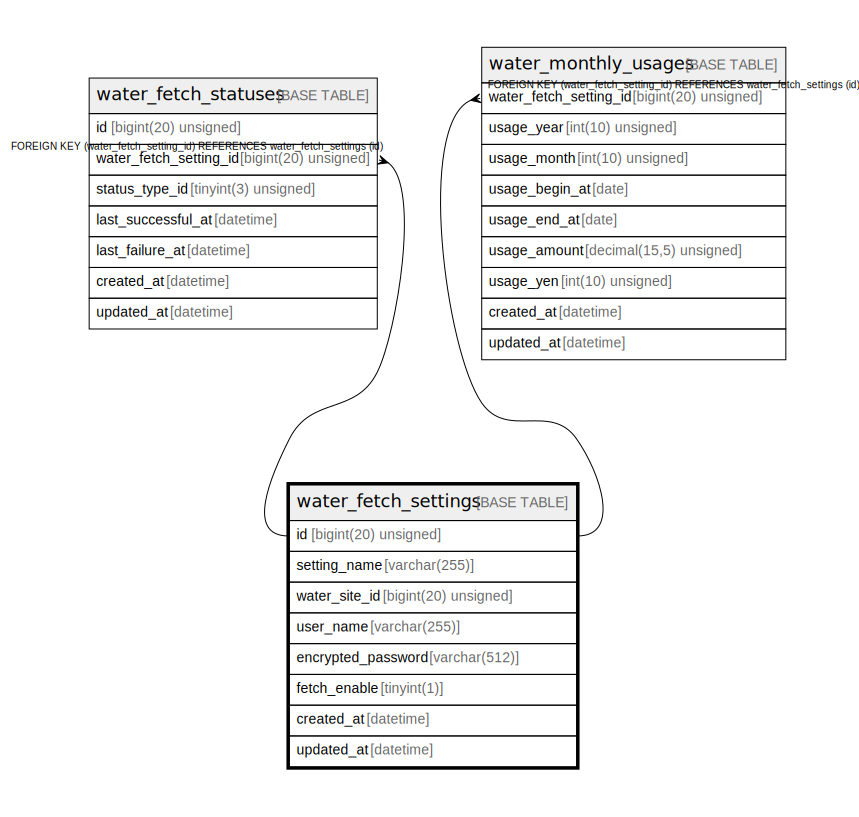

# water_fetch_settings

## Description

水道料金の取得設定

<details>
<summary><strong>Table Definition</strong></summary>

```sql
CREATE TABLE `water_fetch_settings` (
  `water_site_id` bigint(20) unsigned NOT NULL COMMENT '水道料金サイトID',
  `user_name` varchar(255) NOT NULL COMMENT 'ユーザー名',
  `encrypted_password` varchar(512) NOT NULL COMMENT '暗号化済パスワード',
  `created_at` datetime NOT NULL DEFAULT current_timestamp() COMMENT '作成日時(UTC)',
  `updated_at` datetime NOT NULL DEFAULT current_timestamp() ON UPDATE current_timestamp() COMMENT '更新日時(UTC)',
  PRIMARY KEY (`water_site_id`,`user_name`)
) ENGINE=InnoDB DEFAULT CHARSET=utf8mb4 COLLATE=utf8mb4_general_ci COMMENT='水道料金の取得設定'
```

</details>

## Columns

| Name | Type | Default | Nullable | Extra Definition | Children | Parents | Comment |
| ---- | ---- | ------- | -------- | ---------------- | -------- | ------- | ------- |
| water_site_id | bigint(20) unsigned |  | false |  |  |  | 水道料金サイトID |
| user_name | varchar(255) |  | false |  |  |  | ユーザー名 |
| encrypted_password | varchar(512) |  | false |  |  |  | 暗号化済パスワード |
| created_at | datetime | current_timestamp() | false |  |  |  | 作成日時(UTC) |
| updated_at | datetime | current_timestamp() | false | on update current_timestamp() |  |  | 更新日時(UTC) |

## Constraints

| Name | Type | Definition |
| ---- | ---- | ---------- |
| PRIMARY | PRIMARY KEY | PRIMARY KEY (water_site_id, user_name) |

## Indexes

| Name | Definition |
| ---- | ---------- |
| PRIMARY | PRIMARY KEY (water_site_id, user_name) USING BTREE |

## Relations



---

> Generated by [tbls](https://github.com/k1LoW/tbls)
