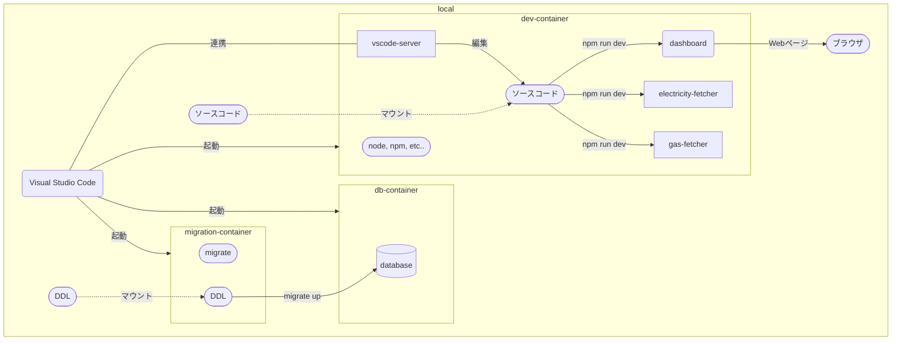

# 開発環境

VSCode の[拡張機能 Dev Containers](https://code.visualstudio.com/docs/devcontainers/containers) を利用してコンテナ内で開発します。



## 構築手順

1. 下記を参考に VSCode と DevContainers をインストール
   - [Developing inside a Container / Installation](https://code.visualstudio.com/docs/devcontainers/containers#_installation)
2. リポジトリをローカル環境に Clone
3. Clone したリポジトリを VSCode の DevContainers で開く
4. 開発用 DB のスキーマを最新化する
   - 手順は開発用 DB の DB 操作を参照
   - DB インスタンスは手順 3 にて自動生成されるため手動作成は不要
5. 開発対象サービスに合わせてセットアップ
   - dashboard
     ```
     cd dashboard
     npm install
     npm run dev
     # http://localhost:3000 でアクセス可能
     ```

## 開発用 DB

### DB 操作

各種 DB ツールで操作可能。
接続情報は[.env](.env)を参照。

スキーマ操作は以下の手順を参考に migration コンテナ経由で行うこと。

1. docker コマンドを使用可能なターミナル上で [makefile](./makefile) の配置ディレクトリを開く
2. make コマンドを使用して DB 操作を行う
   ```
   # スキーマの最新化
   make migrate-up
   # スキーマのバージョンアップ
   make migrate-up-one
   # スキーマのバージョンダウン
   make migrate-down-one
   # スキーマのバージョン確認
   make migrate-version
   ```

### DDL の追加

1. docker コマンドを使用可能なターミナル上で [makefile](./makefile) の配置ディレクトリを開く
2. make コマンドを使用して DDL のテンプレートを生成（ `{name}` は DDL の名称に置き換えること）
   ```
   make name={name} migrate-create
   ```
3. [ddl フォルダ](./migration/ddl/)に生成されたテンプレートに DDL を記載する

   - バージョンアップ用とバージョンダウン用の 2 種類のファイルが生成されるため、それぞれに記載すること

4. make コマンドを使用してテーブル定義書を更新する
   ```
   make tbls-doc
   ```

## 開発環境の削除

docker コマンドを使用可能なターミナル上で下記のコマンドを実行すれば削除可能。

```
# 開発用DB以外を削除
docker compose -f docker-compose-development.yaml down --rmi all --remove-orphans
# 開発用DBも削除したい場合
docker compose -f docker-compose-development.yaml down --rmi all --remove-orphans --volumes
```
