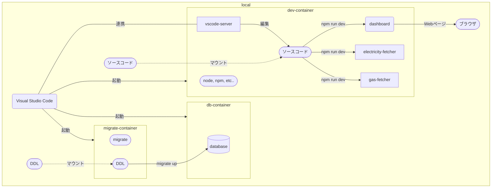

# 開発環境

VSCode の[拡張機能 Dev Containers](https://code.visualstudio.com/docs/devcontainers/containers) を利用してコンテナ内で開発します。



## 構築手順

1. 下記を参考に VSCode と DevContainers をインストール
   - [Developing inside a Container / Installation](https://code.visualstudio.com/docs/devcontainers/containers#_installation)
2. リポジトリをローカル環境に Clone
3. Clone したリポジトリを VSCode の DevContainers で開く
4. 開発用 DB のスキーマ最新化とseedデータ投入を行う
   - 手順は開発用 DB の DB 操作を参照
   - DB インスタンスは手順 3 にて自動生成されるため手動作成は不要
5. 開発対象サービスに合わせてセットアップ
   - dashboard
     ```
     cd dashboard
     npm install
     npm run dev
     # http://localhost:3000 でアクセス可能
     ```

## 開発用 DB

### DB 操作

各種 DB ツールで操作可能。
接続情報は[db.env](../.devcontainer/db.env)を参照。

スキーマ操作は以下の手順を参考に dev コンテナ内で行うこと。

1. npm コマンドを使用して DB 操作を行う

   ```
   ################
   # 開発用DB向け
   ################
   # スキーマのバージョン確認
   npm run db:migrate:version
   # スキーマのバージョンアップ（すべて）
   npm run db:migrate:up-all
   # seedデータ投入
   npm run db:seed
   # スキーマ最新化とseedデータ投入
   npm run db:update

   ################
   # テスト用DB向け
   ################
   # スキーマのバージョン確認
   npm run db:test:migrate:version
   # スキーマのバージョンアップ（すべて）
   npm run db:test:migrate:up-all
   # スキーマのバージョンアップ（1つのみ）
   npm run db:test:migrate:up-one
   # スキーマのバージョンダウン（すべて）
   npm run db:test:migrate:down-all
   # スキーマのバージョンダウン（1つのみ）
   npm run db:test:migrate:down-one
   # スキーマの指定バージョンへのバージョンアップ/ダウン
   npm run db:test:migrate:goto-v v={バージョン}
   # スキーマの現在バージョンの上書き
   npm run db:test:migrate:force-v v={バージョン}
   # seedデータ投入
   npm run db:test:seed
   # スキーマ最新化とseedデータ投入
   npm run db:test:update
   ```

### DDL の追加

1. npm コマンドを使用して DDL のテンプレートを生成（ `{name}` は DDL の名称に置き換えること）
   ```
   npm run create-migrate name={name}
   ```
2. [ddl フォルダ](../db/ddl/)に生成されたテンプレートに DDL を記載する

   - バージョンアップ用とバージョンダウン用の 2 種類のファイルが生成されるため、それぞれに記載すること

## 開発環境の削除

docker コマンドを使用可能なターミナル上で下記のコマンドを実行すれば削除可能。

```
# 開発用DB以外を削除
docker compose -f docker-compose-development.yaml down --rmi all --remove-orphans
# 開発用DBも削除したい場合
docker compose -f docker-compose-development.yaml down --rmi all --remove-orphans --volumes
```
